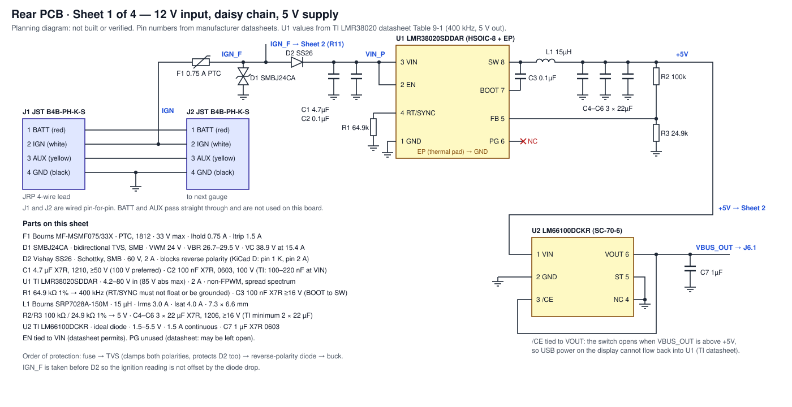
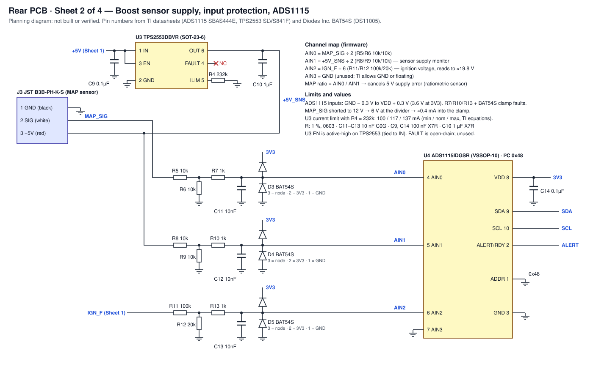
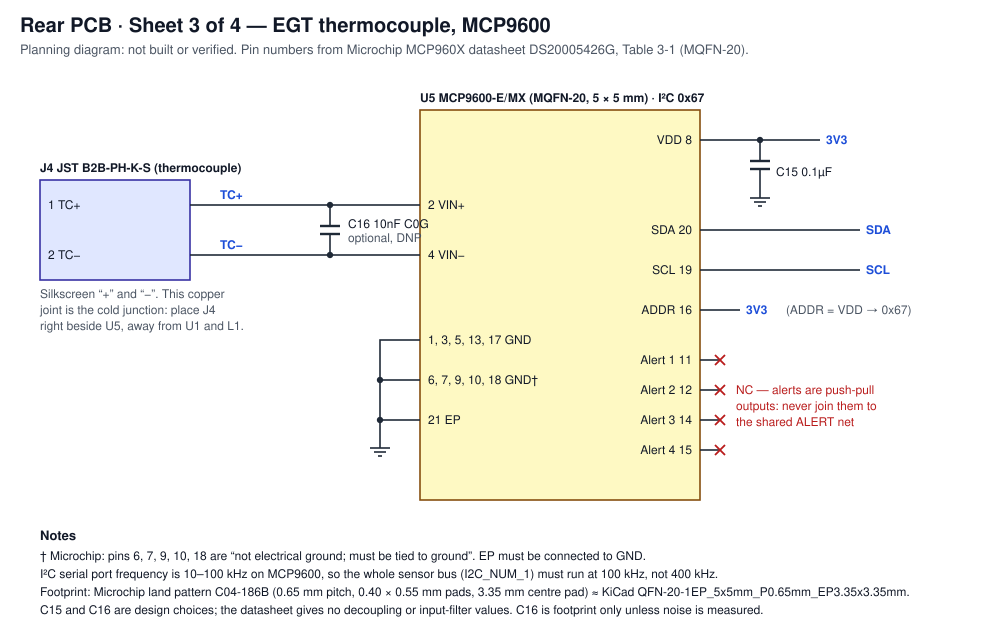
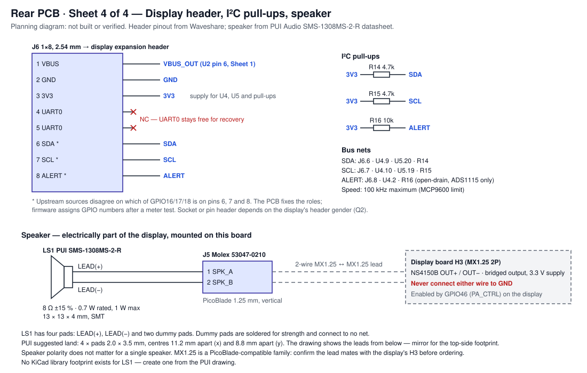

# Rear PCB — Parts and Wiring

The part selection and wiring for the board planned in [rear-pcb.md](rear-pcb.md), written for
entering the schematic in KiCad. Pin numbers come from the manufacturers' datasheets (see
*Sources*); where a value is an engineering choice rather than a datasheet requirement, it is
marked **(choice)**.

> **Status: planning.** Nothing has been drawn in KiCad, ordered, built or measured. Confirm each
> footprint against its datasheet drawing before ordering boards, and resolve the open questions
> in [rear-pcb.md](rear-pcb.md#open-questions) first.

## Sheets

| Sheet | Contents |
|---|---|
| [1 — Power](rear-pcb/sheet1-power.svg) | J1/J2 daisy chain, fuse, TVS, reverse polarity, 5V buck, VBUS feed |
| [2 — Boost and ADC](rear-pcb/sheet2-boost-adc.svg) | Sensor 5V current limit, MAP input, supply and ignition monitors, ADS1115 |
| [3 — EGT](rear-pcb/sheet3-egt.svg) | Thermocouple connector, MCP9600 |
| [4 — Interface and speaker](rear-pcb/sheet4-interface-speaker.svg) | Display header, I2C pull-ups, speaker |

## Bill of materials

Every board is fitted identically (requirement R8 in [rear-pcb.md](rear-pcb.md#requirements)). Resistors are 1%, 0603, unless
stated.

| Ref | Part | Manufacturer | Package | KiCad symbol | KiCad footprint |
|---|---|---|---|---|---|
| J1, J2 | B4B-PH-K-S | JST | PH, 4-pin, 2.0mm, top entry, THT | `Connector_Generic:Conn_01x04` | `Connector_JST:JST_PH_B4B-PH-K_1x04_P2.00mm_Vertical` |
| J3 | B3B-PH-K-S | JST | PH, 3-pin | `Connector_Generic:Conn_01x03` | `Connector_JST:JST_PH_B3B-PH-K_1x03_P2.00mm_Vertical` |
| J4 | B2B-PH-K-S | JST | PH, 2-pin | `Connector_Generic:Conn_01x02` | `Connector_JST:JST_PH_B2B-PH-K_1x02_P2.00mm_Vertical` |
| J5 | 53047-0210 | Molex | PicoBlade 1.25mm, 2-pin, vertical, THT | `Connector_Generic:Conn_01x02` | `Connector_Molex:Molex_PicoBlade_53047-0210_1x02_P1.25mm_Vertical` |
| J6 | 1×8 header, 2.54mm | generic | socket **or** pins — see Q2 | `Connector_Generic:Conn_01x08` | `Connector_PinSocket_2.54mm:PinSocket_1x08_P2.54mm_Vertical` or `Connector_PinHeader_2.54mm:PinHeader_1x08_P2.54mm_Vertical` |
| F1 | MF-MSMF075/33X | Bourns | 1812 PTC | `Device:Polyfuse` | `Fuse:Fuse_1812_4532Metric` |
| D1 | SMBJ24CA | Vishay (or Littelfuse) | SMB / DO-214AA, bidirectional | `Device:D_TVS` | `Diode_SMD:D_SMB` |
| D2 | SS26 (automotive: SS26HE3) | Vishay | SMB / DO-214AA | `Device:D_Schottky` | `Diode_SMD:D_SMB` |
| U1 | LMR38020SDDAR | TI | HSOIC-8 + thermal pad (DDA) | **create** | `Package_SO:SOIC-8-1EP_3.9x4.9mm_P1.27mm_EP2.95x4.9mm_Mask2.71x3.4mm` |
| L1 | SRP7028A-150M | Bourns | 7.3 × 6.6mm | `Device:L` | `Inductor_SMD:L_Bourns_SRP7028A_7.3x6.6mm` |
| U2 | LM66100DCKR | TI | SC-70-6 (DCK) | `Power_Management:LM66100DCK` | `Package_TO_SOT_SMD:SOT-363_SC-70-6` |
| U3 | TPS2553DBVR | TI | SOT-23-6 (DBV) | **create** | `Package_TO_SOT_SMD:SOT-23-6` |
| U4 | ADS1115IDGSR | TI | VSSOP-10 (DGS) | `Analog_ADC:ADS1115IDGS` | symbol default (`Package_SO:TSSOP-10_3x3mm_P0.5mm`) |
| U5 | MCP9600-E/MX | Microchip | MQFN-20, 5 × 5mm | **create** | `Package_DFN_QFN:QFN-20-1EP_5x5mm_P0.65mm_EP3.35x3.35mm` |
| D3–D5 | BAT54S-7-F | Diodes Inc. | SOT-23 | `Diode:BAT54S` | `Package_TO_SOT_SMD:SOT-23` |
| LS1 | SMS-1308MS-2-R | PUI Audio | 13 × 13 × 4mm SMT | `Device:Speaker` | **create** (see [LS1](#ls1--pui-sms-1308ms-2-r)) |
| C1 | 4.7µF, X7R, ≥50V (100V preferred) | — | 1210 | `Device:C` | `Capacitor_SMD:C_1210_3225Metric` |
| C2 | 100nF, X7R, 100V | — | 0603 | `Device:C` | `Capacitor_SMD:C_0603_1608Metric` |
| C3 | 100nF, X7R, ≥16V | — | 0603 | `Device:C` | `Capacitor_SMD:C_0603_1608Metric` |
| C4–C6 | 22µF, X7R, ≥16V | — | 1206 | `Device:C` | `Capacitor_SMD:C_1206_3216Metric` |
| C7, C10 | 1µF, X7R, 10V **(choice)** | — | 0603 | `Device:C` | `Capacitor_SMD:C_0603_1608Metric` |
| C9, C14, C15 | 100nF, X7R **(choice for C15)** | — | 0603 | `Device:C` | `Capacitor_SMD:C_0603_1608Metric` |
| C11–C13 | 10nF, C0G **(choice)** | — | 0603 | `Device:C` | `Capacitor_SMD:C_0603_1608Metric` |
| C16 | 10nF, C0G, **DNP** **(choice)** | — | 0603 | `Device:C` | `Capacitor_SMD:C_0603_1608Metric` |
| R1 | 64.9k | — | 0603 | `Device:R` | `Resistor_SMD:R_0603_1608Metric` |
| R2 | 100k | — | 0603 | `Device:R` | `Resistor_SMD:R_0603_1608Metric` |
| R3 | 24.9k | — | 0603 | `Device:R` | `Resistor_SMD:R_0603_1608Metric` |
| R4 | 232k | — | 0603 | `Device:R` | `Resistor_SMD:R_0603_1608Metric` |
| R5, R6, R8, R9 | 10k | — | 0603 | `Device:R` | `Resistor_SMD:R_0603_1608Metric` |
| R7, R10, R13 | 1k **(choice)** | — | 0603 | `Device:R` | `Resistor_SMD:R_0603_1608Metric` |
| R11 | 100k **(choice)** | — | 0603 | `Device:R` | `Resistor_SMD:R_0603_1608Metric` |
| R12 | 20k **(choice)** | — | 0603 | `Device:R` | `Resistor_SMD:R_0603_1608Metric` |
| R14, R15 | 4.7k **(choice)** | — | 0603 | `Device:R` | `Resistor_SMD:R_0603_1608Metric` |
| R16 | 10k **(choice)** | — | 0603 | `Device:R` | `Resistor_SMD:R_0603_1608Metric` |

Footprint names were checked against the current KiCad library repository, and the symbol names
against the current symbol repository. `C_1210_3225Metric` and `TSSOP-10_3x3mm_P0.5mm` were not
separately listed; confirm they exist in your installed library version.

## Why these parts

| Ref | Why | Key datasheet values |
|---|---|---|
| F1 | Resets itself; a harness fault should not need a soldering iron | 33V max, 0.75A hold, 1.5A trip, AEC-Q200 listed series |
| D1 | Placed **before** D2, so both polarities are clamped and D2 is protected too. Bidirectional, so it cannot be fitted backwards | Standoff 24V (above 14.4V charging and a 24V jump start), breakdown 26.7–29.5V, clamp 38.9V at 15.4A |
| D2 | Reverse-battery block. It drops ~0.5V, which the buck does not care about | 60V, 2A, SMB |
| U1 | 80V input rating leaves wide margin over D1's clamp; easy-to-solder HSOIC | 4.2–80V (85V abs max), 2A, 1.0V reference, high-side current limit 2.6–3.8A. The `S` variant is non-FPWM (efficient at light load) with spread spectrum |
| L1 | Saturation current above U1's maximum current limit | 15µH, Irms 3.0A, **Isat 4.0A > 3.8A** |
| U2 | Blocks USB backfeed without a diode drop on the display supply | 1.5–5.5V, 1.5A, `/CE` tied to VOUT for reverse-current blocking (datasheet pin table) |
| U3 | Current-limits the MAP sensor supply so a pinched harness cannot brown out the display | Limit set by R4; EN active-high; reverse-voltage protection |
| U4 | Existing choice ([ADR 0001](adr/0001-external-i2c-sensor-frontend.md)); three spare inputs used for monitoring | 16-bit, 4 inputs, address set by ADDR |
| U5 | Existing choice ([ADR 0001](adr/0001-external-i2c-sensor-frontend.md)) | K-type with cold-junction compensation, I2C |
| D3–D5 | Clamp each ADC input to GND and 3V3 | Dual series Schottky: pin 1 anode, pin 2 cathode, pin 3 common |
| LS1 | Enclosed SMT speaker, 8Ω as recommended in [rear-pcb.md](rear-pcb.md#speaker-choice) | 8Ω ±15%, 0.7W rated / 1W max, 88dB at 0.1m, −30 to +85°C |

## Pin tables

One row per pin, with the net it connects to. Use these to build the three missing symbols and to
check the others.

### U1 — TI LMR38020SDDAR (HSOIC-8, DDA)

| Pin | Name | Net | Note |
|---|---|---|---|
| 1 | GND | GND | Power and analog ground |
| 2 | EN | VIN_P | Datasheet: "Can be connected directly to VIN. Do not float." |
| 3 | VIN | VIN_P | C1 and C2 as close as possible |
| 4 | RT/SYNC | RT | R1 64.9k to GND → 400kHz (datasheet Table 8-1). Must not float or be grounded |
| 5 | FB | FB | Divider R2/R3 |
| 6 | PG | — | Unconnected. Datasheet: can be left open |
| 7 | BOOT | BOOT | C3 100nF to SW |
| 8 | SW | SW | To L1 |
| EP | Thermal pad | GND | KiCad footprints usually number the exposed pad 9; match it in the symbol |

### U2 — TI LM66100DCKR (SC-70-6, DCK)

The KiCad symbol `Power_Management:LM66100DCK` matches this table.

| Pin | Name | Net | Note |
|---|---|---|---|
| 1 | VIN | +5V | |
| 2 | GND | GND | |
| 3 | /CE | VBUS_OUT | Tied to VOUT for reverse-current protection (datasheet pin table) |
| 4 | N/C | GND | Datasheet: may be tied to GND or left floating |
| 5 | ST | GND | Datasheet: "Connect to GND if not required" |
| 6 | VOUT | VBUS_OUT | To J6 pin 1 |

### U3 — TI TPS2553DBVR (SOT-23-6, DBV)

TPS2552 and TPS2553 share this package but **differ in EN polarity**. This table is for TPS2553
(EN active-high).

| Pin | Name | Net | Note |
|---|---|---|---|
| 1 | IN | +5V | ≥0.1µF to GND close to the pin (C9) |
| 2 | GND | GND | |
| 3 | EN | +5V | Active high on TPS2553: always on |
| 4 | FAULT | — | Open-drain, active low; unused |
| 5 | ILIM | ILIM | R4 232k to GND. Datasheet range 15k–232k |
| 6 | OUT | +5V_SNS | To J3 pin 3, R8, C10 |

### U4 — TI ADS1115IDGSR (VSSOP-10, DGS)

| Pin | Name | Net | Note |
|---|---|---|---|
| 1 | ADDR | GND | GND → address 1001000b = **0x48** |
| 2 | ALERT/RDY | ALERT | Open-drain; R16 pull-up |
| 3 | GND | GND | |
| 4 | AIN0 | AIN0 | MAP sensor ÷ 2 |
| 5 | AIN1 | AIN1 | Sensor supply ÷ 2 |
| 6 | AIN2 | AIN2 | Ignition ÷ 6 |
| 7 | AIN3 | GND | Unused. Datasheet: float or tie to GND |
| 8 | VDD | 3V3 | C14 100nF |
| 9 | SDA | SDA | |
| 10 | SCL | SCL | |

### U5 — Microchip MCP9600-E/MX (MQFN-20)

| Pin | Name | Net | Note |
|---|---|---|---|
| 1, 3, 5, 13, 17 | GND | GND | Electrical ground |
| 2 | VIN+ | TC+ | |
| 4 | VIN− | TC− | |
| 6, 7, 9, 10, 18 | GND | GND | Datasheet: "Not Electrical Ground; must be tied to Ground" |
| 8 | VDD | 3V3 | C15 100nF **(choice)** |
| 11 | Alert 1 | — | Unconnected. Push-pull output: must **not** join the open-drain ALERT net |
| 12 | Alert 2 | — | As above |
| 14 | Alert 3 | — | As above |
| 15 | Alert 4 | — | As above |
| 16 | ADDR | 3V3 | VDD → command byte 1100 111x = **0x67** |
| 19 | SCL | SCL | |
| 20 | SDA | SDA | |
| 21 | EP | GND | Exposed pad; must be connected to GND |

**Footprint check:** Microchip's recommended land pattern (drawing C04-186B) is 0.65mm pitch,
0.40 × 0.55mm pads, 4.50mm pad-row spacing and a centre pad up to 3.35 × 3.35mm. Compare the KiCad
footprint's pads against those numbers; the package body's exposed pad is 3.25mm nominal.

### D3–D5 — Diodes Inc. BAT54S (SOT-23)

The KiCad symbol `Diode:BAT54S` uses the same numbering.

| Pin | Name | D3 net | D4 net | D5 net |
|---|---|---|---|---|
| 1 | Anode (lower diode) | GND | GND | GND |
| 2 | Cathode (upper diode) | 3V3 | 3V3 | 3V3 |
| 3 | Common | AIN0 | AIN1 | AIN2 |

### Two-terminal parts

| Ref | Pin 1 | Pin 2 | Note |
|---|---|---|---|
| F1 | IGN | IGN_F | |
| D1 | IGN_F | GND | Bidirectional: either orientation |
| D2 | VIN_P (cathode, K) | IGN_F (anode, A) | KiCad `D_Schottky`: pin 1 = K. Cathode band toward U1 |
| L1 | SW | +5V | |
| C1, C2 | VIN_P | GND | |
| C3 | BOOT | SW | |
| C4–C6 | +5V | GND | |
| C7 | VBUS_OUT | GND | |
| C9 | +5V | GND | |
| C10 | +5V_SNS | GND | |
| C11 / C12 / C13 | AIN0 / AIN1 / AIN2 | GND | |
| C14, C15 | 3V3 | GND | |
| C16 | TC+ | TC− | DNP |
| R1 | RT | GND | |
| R2 | +5V | FB | |
| R3 | FB | GND | |
| R4 | ILIM | GND | |
| R5 / R6 / R7 | MAP_SIG → AIN0_DIV / AIN0_DIV → GND / AIN0_DIV → AIN0 | | |
| R8 / R9 / R10 | +5V_SNS → AIN1_DIV / AIN1_DIV → GND / AIN1_DIV → AIN1 | | |
| R11 / R12 / R13 | IGN_F → AIN2_DIV / AIN2_DIV → GND / AIN2_DIV → AIN2 | | |
| R14 / R15 / R16 | 3V3 → SDA / 3V3 → SCL / 3V3 → ALERT | | |

### Connectors

| Ref | Pin | Net | Wire |
|---|---|---|---|
| J1, J2 | 1 | BATT | Red, 12V battery (pass-through only) |
| | 2 | IGN | White, 12V ignition |
| | 3 | AUX | Yellow, unused (pass-through only) |
| | 4 | GND | Black |
| J3 | 1 | GND | Black |
| | 2 | MAP_SIG | White |
| | 3 | +5V_SNS | Red |
| J4 | 1 | TC+ | Probe positive (colour to be confirmed, Q5) |
| | 2 | TC− | Probe negative |
| J5 | 1 | SPK_A | LS1 LEAD(+) |
| | 2 | SPK_B | LS1 LEAD(−) |
| J6 | 1 | VBUS_OUT | Display VBUS |
| | 2 | GND | |
| | 3 | 3V3 | Display 3.3V rail (supply for U4, U5, pull-ups) |
| | 4, 5 | — | Display UART0; unconnected |
| | 6 | SDA | GPIO number unconfirmed ([header conflict](rear-pcb.md#the-header--source-conflict-resolve-before-layout)) |
| | 7 | SCL | as above |
| | 8 | ALERT | as above |

The wire order for J1–J4 follows the "left to right" colours supplied so far. Match it to each
connector's pin 1 before fixing the footprints (Q4).

### LS1 — PUI SMS-1308MS-2-R

No library footprint exists. From PUI's drawing and suggested land pattern:

| Item | Value |
|---|---|
| Body | 13 × 13 × 4mm |
| Pads | 4 × 2.0mm (x) × 3.5mm (y) |
| Pad centres | 11.2mm apart in x, 8.8mm apart in y |
| Electrical | LEAD(+) and LEAD(−), the two pads on one edge. The other two are **dummy leads**: solder them, connect no net |
| Orientation | PUI draws the leads **from below**. Mirror left and right for the top-side footprint |

Speaker polarity does not matter with a single speaker.

## Nets

| Net | Connections |
|---|---|
| BATT | J1.1, J2.1 |
| AUX | J1.3, J2.3 |
| IGN | J1.2, J2.2, F1.1 |
| IGN_F | F1.2, D1.1, D2.A, R11.1 |
| VIN_P | D2.K, C1, C2, U1.2 (EN), U1.3 (VIN) |
| RT | U1.4, R1 |
| BOOT | U1.7, C3 |
| SW | U1.8, C3, L1.1 |
| FB | U1.5, R2, R3 |
| +5V | L1.2, C4, C5, C6, R2, U2.1, U3.1, U3.3, C9 |
| VBUS_OUT | U2.3, U2.6, C7, J6.1 |
| ILIM | U3.5, R4 |
| +5V_SNS | U3.6, C10, J3.3, R8 |
| MAP_SIG | J3.2, R5 |
| AIN0_DIV / AIN1_DIV / AIN2_DIV | R5·R6·R7 / R8·R9·R10 / R11·R12·R13 |
| AIN0 | R7, C11, D3.3, U4.4 |
| AIN1 | R10, C12, D4.3, U4.5 |
| AIN2 | R13, C13, D5.3, U4.6 |
| 3V3 | J6.3, U4.8, U5.8, U5.16, C14, C15, D3.2, D4.2, D5.2, R14, R15, R16 |
| SDA | J6.6, U4.9, U5.20, R14 |
| SCL | J6.7, U4.10, U5.19, R15 |
| ALERT | J6.8, U4.2, R16 |
| TC+ | J4.1, U5.2, C16 |
| TC− | J4.2, U5.4, C16 |
| SPK_A / SPK_B | LS1 LEAD(+) · J5.1 / LS1 LEAD(−) · J5.2 |
| GND | J1.4, J2.4, J3.1, J6.2, D1.2, C1–C7, C9–C15 (pin 2), R1, R3, R4, R6, R9, R12, U1.1, U1.EP, U2.2, U2.4, U2.5, U3.2, U4.1, U4.3, U4.7, U5.1/3/5/6/7/9/10/13/17/18/21, D3.1, D4.1, D5.1 |
| No connect | U1.6, U3.4, U5.11/12/14/15, J6.4, J6.5 |

## Design values

| Quantity | Calculation | Result |
|---|---|---|
| Buck output | `VREF × (1 + R2/R3)` = 1.0 × (1 + 100/24.9) | **5.02V** (reference 0.985–1.015V → 4.94–5.09V) |
| Switching frequency | R1 = 64.9k (datasheet Table 8-1) | 400kHz |
| Inductor margin | Isat vs. U1 high-side current limit maximum | 4.0A > 3.8A |
| Sensor supply limit | TPS2553 equations with R4 = 232k | 100 / 117 / 137mA (min / nom / max) |
| MAP input | R5/R6 = 10k/10k | AIN0 = MAP ÷ 2; 5V → 2.5V |
| Sensor supply monitor | R8/R9 = 10k/10k | AIN1 = +5V_SNS ÷ 2 |
| Ignition monitor | R11/R12 = 100k/20k | AIN2 = IGN_F ÷ 6; 3.3V reads 19.8V |
| Fault clamp current | MAP_SIG shorted to 12V: (6V − 3.6V) / (5k + 1k) | ≈0.4mA into D3 |
| ADC input source impedance | 5k Thevenin + 1k vs. ADS1115 6MΩ common-mode impedance (±4.096V range) | ≈0.1% — within calibration |

**Buck output and the display's USB TVS.** Across the full reference tolerance, the output can
reach 5.09V. The display's USB TVS (`LTVS16H5.0ET5G`) is rated for 5.0V. Check its breakdown
voltage before assuming that is harmless, or change R3 to trim the output slightly lower.

## Firmware consequences

These follow from the hardware and change what [sensor-frontend.md](sensor-frontend.md) previously
assumed:

- **The sensor bus runs at 100 kHz.** The MCP9600 datasheet limits I2C to 10–100 kHz, so
  `I2C_NUM_1` cannot use 400 kHz.
- **GPIO16 carries only the ADS1115 ALERT/RDY.** The MCP9600's alert outputs are push-pull and
  are left unconnected. Thermocouple faults are read by polling.
- **Boost uses a ratio.** The MAP sensor is ratiometric, so `AIN0 / AIN1` measures the sensor
  output as a fraction of its actual supply. This cancels drift in the 5V rail and the current
  limiter's drop.
- **Two new readings are free:** the sensor supply (AIN1, also a harness-fault indicator: it
  collapses if U3 limits) and ignition voltage (AIN2).

## Before ordering

- Resolve [rear-pcb.md](rear-pcb.md#open-questions) Q1–Q8, especially the header gender and
  position (Q2) and the JRP connector family and pin order (Q3, Q4).
- Confirm the MX1.25 lead mates with both J5 and the display's H3.
- Build the LS1 footprint and check it against a physical speaker.
- Check the KiCad pad numbering of U1's and U5's exposed pads against your symbols.
- Bench-test U2 with USB plugged into the display while the board is powered, and confirm no
  current flows back into the buck.

## Sources

- TI [LMR38020](https://www.ti.com/lit/ds/symlink/lmr38020.pdf) (SNVSC40E),
  [LM66100](https://www.ti.com/lit/ds/symlink/lm66100.pdf) (SLVSEZ8A),
  [TPS2553](https://www.ti.com/lit/ds/symlink/tps2553.pdf) (SLVS841F),
  [ADS1115](https://www.ti.com/lit/ds/symlink/ads1115.pdf) (SBAS444E)
- Microchip [MCP960X](https://ww1.microchip.com/downloads/en/DeviceDoc/MCP960X-Data-Sheet-20005426.pdf) (DS20005426G)
- Diodes Inc. [BAT54/A/C/S](https://www.diodes.com/assets/Datasheets/ds11005.pdf) (DS11005)
- Vishay [SS22–SS26](https://www.vishay.com/docs/88748/ss22.pdf),
  [SMBJ series](https://www.vishay.com/docs/88392/smbj.pdf)
- Bourns [MF-MSMF](https://www.bourns.com/docs/Product-Datasheets/mf-msmf.pdf),
  [SRP7028A](https://www.bourns.com/docs/Product-Datasheets/SRP7028A.pdf)
- JST [PH connector](https://www.jst-mfg.com/product/pdf/eng/ePH.pdf)
- PUI Audio [SMS-1308MS-2-R](https://puiaudio.com/file/specs-SMS-1308MS-2-R.pdf)
- KiCad [footprint](https://gitlab.com/kicad/libraries/kicad-footprints) and
  [symbol](https://gitlab.com/kicad/libraries/kicad-symbols) libraries
- The Molex 53047 drawing could not be downloaded here; the footprint is taken from the KiCad
  library, which names that part.
