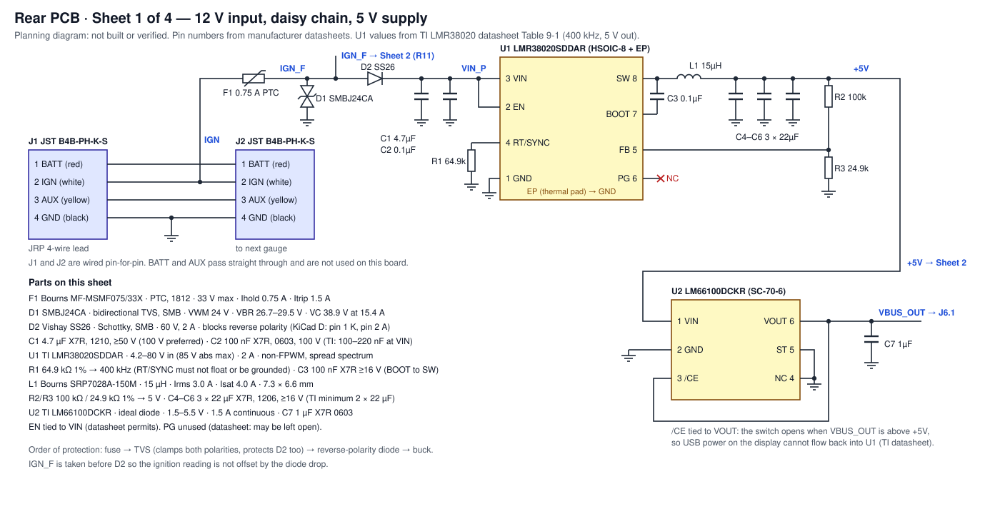
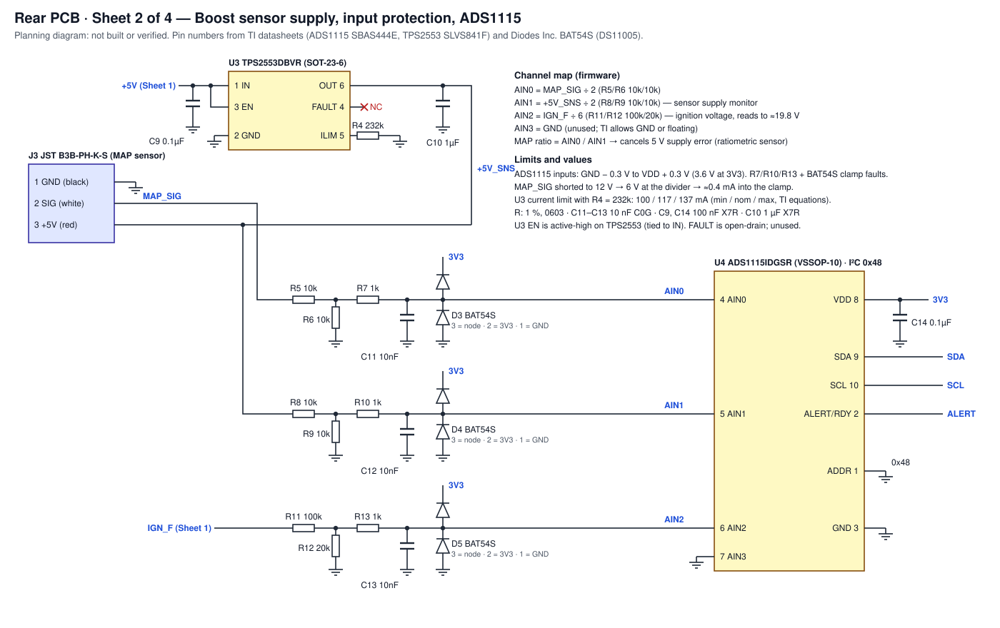
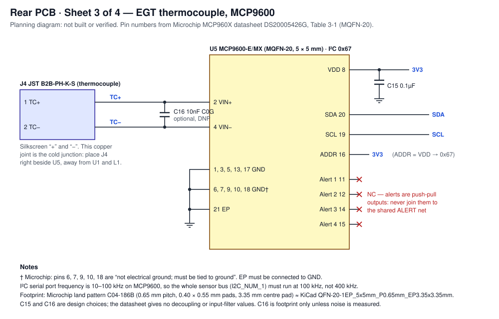
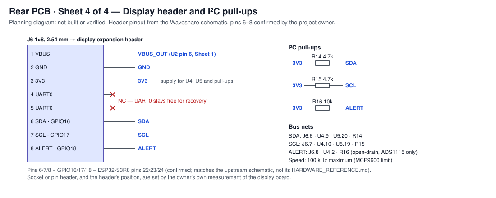

# Rear PCB — Parts and Wiring

The part selection and wiring for the board planned in [rear-pcb.md](rear-pcb.md), written for
entering the schematic in KiCad. Pin numbers come from the manufacturers' datasheets (see
*Sources*); where a value is an engineering choice rather than a datasheet requirement, it is
marked **(choice)**.

> **Status: planning.** Nothing has been drawn in KiCad, ordered, built or measured. Confirm each
> footprint against its datasheet drawing before ordering boards, and resolve the open questions
> in [rear-pcb.md](rear-pcb.md#open-questions) first.

## Sheets

| Sheet | Contents |
|---|---|
| [1 — Power](rear-pcb/sheet1-power.svg) | J1/J2 daisy chain, fuse, TVS, reverse polarity, 5V buck, VBUS feed |
| [2 — Boost and ADC](rear-pcb/sheet2-boost-adc.svg) | Sensor 5V current limit, MAP input, supply and ignition monitors, ADS1115 |
| [3 — EGT](rear-pcb/sheet3-egt.svg) | Thermocouple connector, MCP9600. **Out of date**: the schematic now uses ADS1115 AIN3 + TMP1075 (U6) |
| [4 — Interface](rear-pcb/sheet4-interface.svg) | Display header, I2C pull-ups |

## Bill of materials

Every board is fitted identically (requirement R8 in [rear-pcb.md](rear-pcb.md#requirements)). This
table matches the KiCad schematic, which is the source of truth; the `LCSC` field on each symbol
is what JLCPCB assembles. Resistors are 1% thick film. **Hand-soldered** parts are excluded from
the BOM and placement files and fitted after assembly.

| Ref | Part | Manufacturer | LCSC | KiCad symbol | KiCad footprint |
|---|---|---|---|---|---|
| J1, J2 | B4B-PH-K-S, **hand-soldered** | JST | C131334 | `Connector_Generic:Conn_01x04` | `Connector_JST:JST_PH_B4B-PH-K_1x04_P2.00mm_Vertical` |
| J3 | B3B-PH-K-S, **hand-soldered** | JST | C131339 | `Connector_Generic:Conn_01x03` | `Connector_JST:JST_PH_B3B-PH-K_1x03_P2.00mm_Vertical` |
| J4 | B2B-PH-K-S, **hand-soldered** | JST | C131337 | `Connector_Generic:Conn_01x02` | `Connector_JST:JST_PH_B2B-PH-K_1x02_P2.00mm_Vertical` |
| J6 | 1×8 header, 2.54mm, **hand-soldered** | generic | — | `Connector:Conn_01x08_Pin` | `Connector_PinHeader_2.54mm:PinHeader_1x08_P2.54mm_Vertical` |
| TH1 (F1) | BSMD1812-150-33V | BHFUSE | C883154 | `Device:Thermistor_PTC` | `Resistor_SMD:R_1812_4532Metric` |
| D1 | SMBJ24CA | — | C78416 | `Device:D_TVS` | `Diode_SMD:D_SMB` |
| D2 | SS210 (100V 2A Schottky) | — | C14996 | `Diode:SS210` | `Diode_SMD:D_SMA` |
| U1 | LMR38020SDDAR | TI | C3192337 | `Project Lib:LMR38020SDDAR` | `Package_SO:Texas_HSOP-8-1EP_3.9x4.9mm_P1.27mm` |
| L1 | SRP7028A-150M | Bourns | C1847948 | `Device:L` | `Inductor_SMD:L_Bourns_SRP7028A_7.3x6.6mm` |
| U2 | LM66100DCKR | TI | C2869734 | `Power_Management:LM66100DCK` | `Package_TO_SOT_SMD:SOT-363_SC-70-6` |
| U3 | TPS2553DBVR | TI | C55266 | `Project Lib:TPS2553DBVR` | `Package_TO_SOT_SMD:SOT-23-6` |
| U4 | ADS1115IDGSR | TI | C37593 | `Analog_ADC:ADS1115IDGS` | `Package_SO:TSSOP-10_3x3mm_P0.5mm` |
| U6 | TMP1075DGKR | TI | C2864807 | `Sensor_Temperature:TMP1075DGK` | `Package_SO:VSSOP-8_3x3mm_P0.65mm` |
| D3–D5 | BAV99 | Nexperia | C2500 | `Diode:BAV99` | `Package_TO_SOT_SMD:SOT-23` |
| C1 | 10µF, X5R, 50V | Murata | C440198 | `Device:C` | `Capacitor_SMD:C_0805_2012Metric` |
| C2 | 100nF, X7R, 100V | Samsung | C28233 | `Device:C` | `Capacitor_SMD:C_0805_2012Metric` |
| C3, C9, C16, C18 | 100nF, X7R, 50V | Yageo | C49678 | `Device:C` | `Capacitor_SMD:C_0805_2012Metric` |
| C4–C6 | 22µF, X5R, 25V | Samsung | C45783 | `Device:C` | `Capacitor_SMD:C_0805_2012Metric` |
| C7, C10 | 1µF, X7R, 50V | Samsung | C28323 | `Device:C` | `Capacitor_SMD:C_0805_2012Metric` |
| C11–C13 | 10nF, X7R, 50V | FH | C57112 | `Device:C` | `Capacitor_SMD:C_0603_1608Metric` |
| C14, C17 | 10nF, X7R, 50V | Samsung | C1710 | `Device:C` | `Capacitor_SMD:C_0805_2012Metric` |
| R1 | 68k | UNI-ROYAL | C17801 | `Device:R` | `Resistor_SMD:R_0805_2012Metric` |
| R2 | 33k | UNI-ROYAL | C17633 | `Device:R` | `Resistor_SMD:R_0805_2012Metric` |
| R3 | 8.2k | UNI-ROYAL | C17828 | `Device:R` | `Resistor_SMD:R_0805_2012Metric` |
| R4 | 220k | UNI-ROYAL | C17556 | `Device:R` | `Resistor_SMD:R_0805_2012Metric` |
| R5, R6, R8, R9, R16 | 10k | UNI-ROYAL | C17414 | `Device:R` | `Resistor_SMD:R_0805_2012Metric` |
| R7, R10, R13, R17 | 1k | UNI-ROYAL | C17513 | `Device:R` | `Resistor_SMD:R_0805_2012Metric` |
| R11 | 100k | UNI-ROYAL | C149504 | `Device:R` | `Resistor_SMD:R_0805_2012Metric` |
| R12 | 20k | UNI-ROYAL | C4328 | `Device:R` | `Resistor_SMD:R_0805_2012Metric` |
| R14, R15 | 4.7k | UNI-ROYAL | C17673 | `Device:R` | `Resistor_SMD:R_0805_2012Metric` |
| R18 | 1M | UNI-ROYAL | C17514 | `Device:R` | `Resistor_SMD:R_0805_2012Metric` |

Most passives, SS210 and BAV99 are JLCPCB **Basic** parts, which have no per-part setup fee.
Those values were chosen from the Basic range, so R1–R4 and C1 differ from the datasheet
examples; see *Design values*.

> **TH1's thermal derating is unconfirmed.** The BHFUSE datasheet could not be retrieved. The
> margin figures below assume the usual 1812 PPTC curve (about 1.0A hold at 60°C), matching the
> Bourns part it replaces. Check the curve before relying on the 70°C figure.

Footprint names were checked against the current KiCad library repository, and the symbol names
against the current symbol repository. `TSSOP-10_3x3mm_P0.5mm` was not separately listed; confirm
it exists in your installed library version.

## Why these parts

| Ref | Why | Key datasheet values |
|---|---|---|
| F1 | Resets itself; a harness fault should not need a soldering iron. Sized for the 1.5A-at-5V target after thermal derating. BSMD1812-150-33V rather than Bourns MF-MSMF150/24X: same hold/trip, but 33V instead of 24V, because F1 sits ahead of D1 and sees near-full surge voltage when it trips | 33V max, 40A max interrupt, hold 1.5A / trip 3.0A at 23°C, 500ms max time-to-trip, 40–160mΩ |
| D1 | Placed **before** D2, so both polarities are clamped and D2 is protected too. Bidirectional, so it cannot be fitted backwards | Standoff 24V (above 14.4V charging and a 24V jump start), breakdown 26.7–29.5V, clamp 38.9V at 15.4A |
| D2 | Reverse-battery block. It drops ~0.85V, which the buck does not care about. SS210 rather than SS26 because it is a JLCPCB Basic part | 100V, 2A, SMA |
| U1 | 80V input rating leaves wide margin over D1's clamp; easy-to-solder HSOIC | 4.2–80V (85V abs max), 2A, 1.0V reference, high-side current limit 2.6–3.8A. The `S` variant is non-FPWM (efficient at light load) with spread spectrum |
| L1 | Saturation current above U1's maximum current limit | 15µH, Irms 3.0A, **Isat 4.0A > 3.8A** |
| U2 | Blocks USB backfeed without a diode drop on the display supply | 1.5–5.5V, `/CE` tied to VOUT for reverse-current blocking (datasheet pin table). **1.5A is its absolute-maximum continuous current**: the ceiling for the display feed |
| U3 | Current-limits the MAP sensor supply so a pinched harness cannot brown out the display | Limit set by R4; EN active-high; reverse-voltage protection |
| U4 | Existing choice ([ADR 0001](adr/0001-external-i2c-sensor-frontend.md)). AIN0–2 are MAP, sensor supply and ignition; AIN3 reads the thermocouple directly at ±0.256V | 16-bit, 4 inputs, address set by ADDR |
| U6 | Cold-junction sensor for the thermocouple. Replaced the ~$10 MCP9600 ([sensor-frontend.md](sensor-frontend.md#egt--k-type-thermocouple-via-ads1115-ain3--tmp1075)) | ±1°C max, 12-bit, 0.0625°C/LSB, 8 I2C addresses from A0–A2 |
| D3–D5 | Clamp each ADC input to GND and 3V3. BAV99 rather than BAT54S because it is a JLCPCB Basic part. The series 1k keeps any fault current far below the ADS1115's 10mA input limit, so the higher forward voltage doesn't matter | Dual series diode: pin 1 anode, pin 2 cathode, pin 3 common (same as BAT54S) |
| R17, R18, C14, C17 | Thermocouple input: 1k + 10nF filter into AIN3, 10nF across the probe, 1M open-probe pull-up. **No clamp diode**: its leakage into R17 would be a large temperature error | See [sensor-frontend.md](sensor-frontend.md) |

## Pin tables

One row per pin, with the net it connects to. Use these to build the three missing symbols and to
check the others. The speaker is not part of this board: it plugs straight into the display's
H3 connector ([hardware-reference.md](hardware-reference.md)).

### U1 — TI LMR38020SDDAR (HSOIC-8, DDA)

| Pin | Name | Net | Note |
|---|---|---|---|
| 1 | GND | GND | Power and analog ground |
| 2 | EN | VIN_P | Datasheet: "Can be connected directly to VIN. Do not float." |
| 3 | VIN | VIN_P | C1 and C2 as close as possible |
| 4 | RT/SYNC | RT | R1 68k to GND → ~388kHz (datasheet Eq. 2). Must not float or be grounded |
| 5 | FB | FB | Divider R2/R3 |
| 6 | PG | — | Unconnected. Datasheet: can be left open |
| 7 | BOOT | BOOT | C3 100nF to SW |
| 8 | SW | SW | To L1 |
| EP | Thermal pad | GND | KiCad footprints usually number the exposed pad 9; match it in the symbol |

### U2 — TI LM66100DCKR (SC-70-6, DCK)

The KiCad symbol `Power_Management:LM66100DCK` matches this table.

| Pin | Name | Net | Note |
|---|---|---|---|
| 1 | VIN | +5V | |
| 2 | GND | GND | |
| 3 | /CE | VBUS_OUT | Tied to VOUT for reverse-current protection (datasheet pin table) |
| 4 | N/C | GND | Datasheet: may be tied to GND or left floating |
| 5 | ST | GND | Datasheet: "Connect to GND if not required" |
| 6 | VOUT | VBUS_OUT | To J6 pin 1 |

### U3 — TI TPS2553DBVR (SOT-23-6, DBV)

TPS2552 and TPS2553 share this package but **differ in EN polarity**. This table is for TPS2553
(EN active-high).

| Pin | Name | Net | Note |
|---|---|---|---|
| 1 | IN | +5V | ≥0.1µF to GND close to the pin (C9) |
| 2 | GND | GND | |
| 3 | EN | +5V | Active high on TPS2553: always on |
| 4 | FAULT | — | Open-drain, active low; unused |
| 5 | ILIM | ILIM | R4 220k to GND. Datasheet range 15k–232k |
| 6 | OUT | +5V_SNS | To J3 pin 3, R8, C10 |

### U4 — TI ADS1115IDGSR (VSSOP-10, DGS)

| Pin | Name | Net | Note |
|---|---|---|---|
| 1 | ADDR | GND | GND → address 1001000b = **0x48** |
| 2 | ALERT/RDY | ALERT | Open-drain; R16 pull-up |
| 3 | GND | GND | |
| 4 | AIN0 | AIN0 | MAP sensor ÷ 2 |
| 5 | AIN1 | AIN1 | Sensor supply ÷ 2 |
| 6 | AIN2 | AIN2 | Ignition ÷ 6 |
| 7 | AIN3 | TC_IN | Thermocouple via R17; no clamp diode |
| 8 | VDD | 3V3 | C16 100nF to GND |
| 9 | SDA | SDA | |
| 10 | SCL | SCL | |

### U6 — TI TMP1075DGKR (VSSOP-8, DGK)

The KiCad symbol `Sensor_Temperature:TMP1075DGK` matches this table. Place it **immediately
beside J4** on the same ground pour: it measures the thermocouple's cold junction.

| Pin | Name | Net | Note |
|---|---|---|---|
| 1 | SDA | SDA | |
| 2 | SCL | SCL | |
| 3 | ALERT | — | Unconnected (no-connect flag) |
| 4 | GND | GND | |
| 5 | A2 | GND | |
| 6 | A1 | GND | |
| 7 | A0 | 3V3 | A2 A1 A0 = 0 0 1 → **0x49** (datasheet Table 7-2); 0x48 is the ADS1115. The first assembled board answers at **0x4F** ([sensor-frontend.md](sensor-frontend.md#verification)) |
| 8 | V+ | 3V3 | C18 100nF to GND |

### D3–D5 — Nexperia BAV99 (SOT-23)

Same pinout as the BAT54S it replaced. The KiCad symbol `Diode:BAV99` uses the same numbering.

| Pin | Name | D3 net | D4 net | D5 net |
|---|---|---|---|---|
| 1 | Anode (lower diode) | GND | GND | GND |
| 2 | Cathode (upper diode) | 3V3 | 3V3 | 3V3 |
| 3 | Common | AIN0 | AIN1 | AIN2 |

### Two-terminal parts

| Ref | Pin 1 | Pin 2 | Note |
|---|---|---|---|
| F1 | IGN | IGN_F | |
| D1 | IGN_F | GND | Bidirectional: either orientation |
| D2 | VIN_P (cathode, K) | IGN_F (anode, A) | KiCad `D_Schottky`: pin 1 = K. Cathode band toward U1 |
| L1 | SW | +5V | |
| C1, C2 | VIN_P | GND | |
| C3 | BOOT | SW | |
| C4–C6 | +5V | GND | |
| C7 | VBUS_OUT | GND | |
| C9 | +5V | GND | |
| C10 | +5V_SNS | GND | |
| C11 / C12 / C13 | AIN0 / AIN1 / AIN2 | GND | |
| C16, C18 | 3V3 | GND | U4 and U6 decoupling |
| C14 | TC+ | TC− | Across the probe |
| C17 | TC_IN | GND | AIN3 filter |
| R1 | RT | GND | |
| R2 | +5V | FB | |
| R3 | FB | GND | |
| R4 | ILIM | GND | |
| R5 / R6 / R7 | MAP_SIG → AIN0_DIV / AIN0_DIV → GND / AIN0_DIV → AIN0 | | |
| R8 / R9 / R10 | +5V_SNS → AIN1_DIV / AIN1_DIV → GND / AIN1_DIV → AIN1 | | |
| R11 / R12 / R13 | IGN_F → AIN2_DIV / AIN2_DIV → GND / AIN2_DIV → AIN2 | | |
| R14 / R15 / R16 | 3V3 → SDA / 3V3 → SCL / 3V3 → ALERT | | |
| R17 / R18 | TC+ → TC_IN / 3V3 → TC+ | | Filter / open-probe pull-up |

### Connectors

| Ref | Pin | Net | Wire |
|---|---|---|---|
| J1, J2 | 1 | BATT | Red, 12V battery (pass-through only) |
| | 2 | IGN | White, 12V ignition |
| | 3 | AUX | Yellow, unused (pass-through only) |
| | 4 | GND | Black |
| J3 | 1 | GND | Black |
| | 2 | MAP_SIG | White |
| | 3 | +5V_SNS | Red |
| J4 | 1 | TC− (GND) | Probe negative. **The schematic has T− on pin 1**; this table used to say T+. Confirm with Q5 |
| | 2 | TC+ | Probe positive (colour to be confirmed, Q5) |
| J6 | 1 | VBUS_OUT | Display VBUS |
| | 2 | GND | |
| | 3 | 3V3 | Display 3.3V rail (supply for U4, U6, pull-ups) |
| | 4, 5 | — | Display UART0; unconnected |
| | 6 | SDA | GPIO16 (ESP32-S3R8 pin 22) |
| | 7 | SCL | GPIO17 (ESP32-S3R8 pin 23) |
| | 8 | ALERT | GPIO18 (ESP32-S3R8 pin 24) |

Positions follow the owner's "left to right" definition: the leftmost wire, looking from the plug
side while inserting, with the locating tabs up. Before fixing the footprints, confirm once with a
real PH header that position 1 lands on JST's circuit-1 pin (Q3).

## Nets

| Net | Connections |
|---|---|
| BATT | J1.1, J2.1 |
| AUX | J1.3, J2.3 |
| IGN | J1.2, J2.2, F1.1 |
| IGN_F | F1.2, D1.1, D2.A, R11.1 |
| VIN_P | D2.K, C1, C2, U1.2 (EN), U1.3 (VIN) |
| RT | U1.4, R1 |
| BOOT | U1.7, C3 |
| SW | U1.8, C3, L1.1 |
| FB | U1.5, R2, R3 |
| +5V | L1.2, C4, C5, C6, R2, U2.1, U3.1, U3.3, C9 |
| VBUS_OUT | U2.3, U2.6, C7, J6.1 |
| ILIM | U3.5, R4 |
| +5V_SNS | U3.6, C10, J3.3, R8 |
| MAP_SIG | J3.2, R5 |
| AIN0_DIV / AIN1_DIV / AIN2_DIV | R5·R6·R7 / R8·R9·R10 / R11·R12·R13 |
| AIN0 | R7, C11, D3.3, U4.4 |
| AIN1 | R10, C12, D4.3, U4.5 |
| AIN2 | R13, C13, D5.3, U4.6 |
| TC_IN | R17, C17, U4.7 |
| 3V3 | J6.3, U4.8, U6.7, U6.8, C16, C18, D3.2, D4.2, D5.2, R14, R15, R16, R18 |
| SDA | J6.6, U4.9, U6.1, R14 |
| SCL | J6.7, U4.10, U6.2, R15 |
| ALERT | J6.8, U4.2, R16 |
| TC+ | J4.2, C14.1, R17, R18 |
| TC− | J4.1, C14.2 — tied to GND |
| GND | J1.4, J2.4, J3.1, J6.2, D1.2, C1–C7, C9–C13, C16 (pin 2), R1, R3, R4, R6, R9, R12, U1.1, U1.EP, U2.2, U2.4, U2.5, U3.2, U4.1, U4.3, U6.4, U6.5, U6.6, C17, C18, J4.1, D3.1, D4.1, D5.1 |
| No connect | U1.6, U3.4, U6.3, J6.4, J6.5 |

## Design values

| Quantity | Calculation | Result |
|---|---|---|
| Buck output | `VREF × (1 + R2/R3)` = 1.0 × (1 + 33/8.2) | **5.02V** (reference 0.985–1.015V → 4.95–5.10V) |
| Switching frequency | R1 = 68k, `fSW = (30970 / RT)^(1/1.027)` (datasheet Eq. 2) | ≈388kHz |
| Inductor margin | Isat vs. U1 high-side current limit maximum | 4.0A > 3.8A |
| Sensor supply limit | TPS2553 equations with R4 = 220k | ≈105 / 123 / 144mA (min / nom / max; scaled from the 232k figures) |
| MAP input | R5/R6 = 10k/10k | AIN0 = MAP ÷ 2; 5V → 2.5V |
| Sensor supply monitor | R8/R9 = 10k/10k | AIN1 = +5V_SNS ÷ 2 |
| Ignition monitor | R11/R12 = 100k/20k | AIN2 = IGN_F ÷ 6; 3.3V reads 19.8V |
| Fault clamp current | MAP_SIG shorted to 12V: (6V − 3.6V) / (5k + 1k) | ≈0.4mA into D3 |
\1| Input current at the 1.5A target | 5V × 1.5A ÷ ~85% efficiency (assumed) ÷ VIN | ≈0.64A at 13.8V, 0.74A at 12V, 0.88A at 10V |
| F1 margin | Hold current vs. 0.74–0.88A | ≈1.0A at 60°C, ≈0.88A at 70°C (assumed derating, see the TH1 note): holds in normal cabin heat, marginal only at low battery above 70°C |

**Buck output and the display's USB TVS.** Across the full reference tolerance, the output can
reach 5.10V. The display's USB TVS (`LTVS16H5.0ET5G`) is rated for 5.0V. Check its breakdown
voltage before assuming that is harmless, or change R3 to trim the output slightly lower.

## Firmware consequences

These follow from the hardware and change what [sensor-frontend.md](sensor-frontend.md) previously
assumed:

- **The sensor bus is SDA GPIO16, SCL GPIO17, ALERT GPIO18.**
- **The sensor bus runs at 100 kHz.** Both devices would allow 400 kHz; 100 kHz is kept
  because the bus leaves the board through the header.
- **GPIO18 carries only the ADS1115 ALERT/RDY.** The TMP1075's ALERT is left unconnected.
- **EGT is computed in firmware**: AIN3 at ±0.256V, plus the TMP1075 (0x49 by design, 0x4F as built) cold-junction
  temperature, through the NIST K-type polynomials. The procedure is in
  [sensor-frontend.md](sensor-frontend.md). AIN3 saturating at 0x7FFF means an open probe.
- **Boost uses a ratio.** The MAP sensor is ratiometric, so `AIN0 / AIN1` measures the sensor
  output as a fraction of its actual supply. This cancels drift in the 5V rail and the current
  limiter's drop.
- **Two new readings are free:** the sensor supply (AIN1, also a harness-fault indicator: it
  collapses if U3 limits) and ignition voltage (AIN2).

## Before ordering

- Resolve the open questions in [rear-pcb.md](rear-pcb.md#open-questions): JRP connector family
  and the pin-1 check (Q3), EGT probe polarity (Q5), display current (Q6).
- Check the KiCad pad numbering of U1's exposed pad against its symbol.
- Bench-test U2 with USB plugged into the display while the board is powered, and confirm no
  current flows back into the buck.

## Sources

- TI [LMR38020](https://www.ti.com/lit/ds/symlink/lmr38020.pdf) (SNVSC40E),
  [LM66100](https://www.ti.com/lit/ds/symlink/lm66100.pdf) (SLVSEZ8A),
  [TPS2553](https://www.ti.com/lit/ds/symlink/tps2553.pdf) (SLVS841F),
  [ADS1115](https://www.ti.com/lit/ds/symlink/ads1115.pdf) (SBAS444E)
- TI [TMP1075](https://www.ti.com/lit/ds/symlink/tmp1075.pdf) (SBOS854F)
- Nexperia [BAV99](https://assets.nexperia.com/documents/data-sheet/BAV99_SER.pdf)
- NIST ITS-90 [thermocouple tables](https://srdata.nist.gov/its90/main/)
- Vishay [SS22–SS26](https://www.vishay.com/docs/88748/ss22.pdf) (the SS210 is the 100V member of the same family),
  [SMBJ series](https://www.vishay.com/docs/88392/smbj.pdf)
- BHFUSE [BSMD1812](https://www.lcsc.com/product-detail/C883154.html) (LCSC C883154)
- Bourns
  [SRP7028A](https://www.bourns.com/docs/Product-Datasheets/SRP7028A.pdf)
- JST [PH connector](https://www.jst-mfg.com/product/pdf/eng/ePH.pdf)
- KiCad [footprint](https://gitlab.com/kicad/libraries/kicad-footprints) and
  [symbol](https://gitlab.com/kicad/libraries/kicad-symbols) libraries
