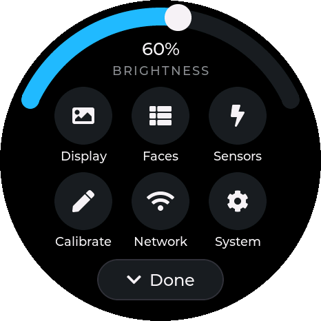
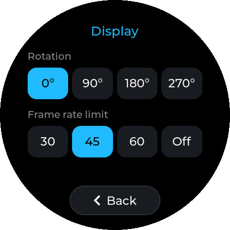
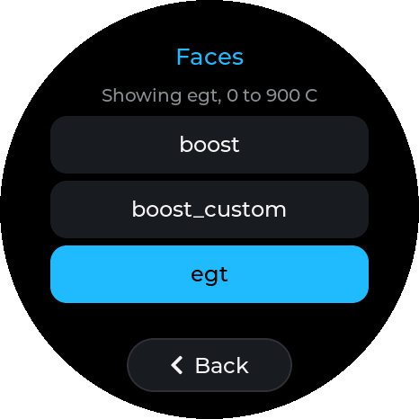
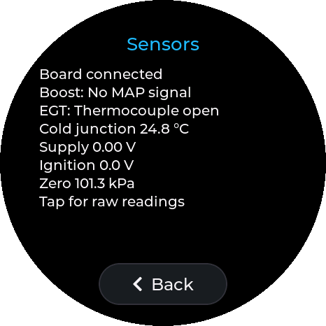
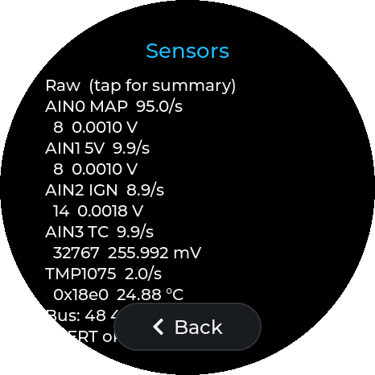
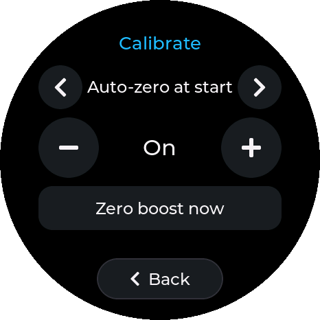
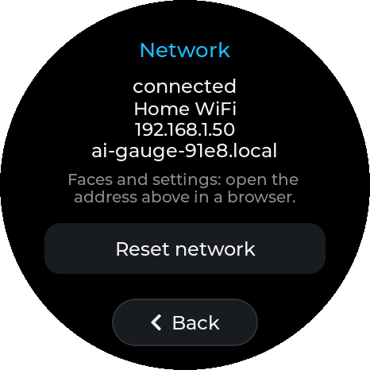
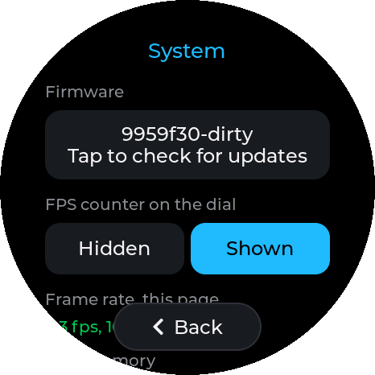

# Settings UI

The settings tile, redesigned 2026-10-01 ([ADR 0011](adr/0011-round-paged-settings.md)). Code:
`firmware/components/app_ui/app_ui_settings.c`. The screenshots below were taken from the gauge
with `tools/remote/gauge_remote.py`, masked to the round panel.

## Constraints it is designed for

- **A 466 px round panel.** The corners do not exist, and the top and bottom are narrow. Anything
  wide sits in the middle band, and anything at the top or bottom is short and centred.
- **Mounted at the base of the A-pillar,** glanced at while driving and touched mostly while
  parked. The dial must be one glance away, and nothing may need precision.
- **Night driving.** Large white areas glare, so there are none: true black (AMOLED pixels off),
  dark-grey controls, and one accent, the needle's cyan.
- **Internal RAM** is the board's binding constraint, and every LVGL widget is a small malloc in
  it (ADR 0009). Only one page exists at a time.

## Structure

| Home | Page (e.g. Display) |
|---|---|
|  |  |

- **Swipe up from the dial** for the settings home, and swipe down or tap **Done** to return.
- **Home:** brightness on an arc around the top rim, six round buttons, and **Done** at the bottom
  centre.
  - The arc is the setting used most in a car (day, dusk, night) and the biggest target on the
    screen. It only responds on the ring itself (`LV_OBJ_FLAG_ADV_HITTEST`), so taps inside it
    reach the buttons.
  - Brightness moves in 5% steps. It applies while dragging and is saved on release.
- **Pages:** a title at the top and a floating **Back** pill at the bottom centre, where the circle
  is still wide. Every page is built when it opens and deleted when it closes.
- **Auto-return:** after 30 s with no touch on the settings tile, the gauge goes back to the dial
  (`SETTINGS_IDLE_MS`).
- Pages are sized to fit above the Back pill without scrolling, except Sensors in its raw view and
  System, which scroll.

## Pages

| | |
|---|---|
|  **Faces**: one full-width button per stored face (a single buttonmatrix), the one on screen highlighted |  **Sensors**: live readings in native units. Tap the readout for the raw view |
|  **Sensors, raw**: ADC codes, pin volts, reads per second, bus scan ([sensor-frontend.md](sensor-frontend.md)) |  **Calibrate**: ‹ › picks the parameter, − and + either side of the value (hold to repeat, saved on release), and *Zero boost now* |
|  **Network**: connection details on separate lines, and *Reset network*, which takes two taps within 4 s |  **System**: firmware card (tap to check for updates, twice to install), FPS counter, frame rate, memory |

**Display** has rotation and the frame-rate limit. The FPS counter moved to System, beside the
numbers it explains.

## Rules for changing it

- **Check it on the glass.** Take screenshots with `gauge_remote.py HOST shot out.png`: they are
  masked to the circle, so clipping shows. Drive it with `tap`/`swipe`.
- **Keep every control at least 64 px** (`CONTROL_H`), text at least 18 px, and body text 24 px.
- **Add widgets to pages, not to the home screen.** Home widgets live for as long as the gauge runs.
- **Use shared styles** (`st.*`), not per-object `lv_obj_set_style_*`, where a style repeats.
  Local styles cost internal RAM on every object.
- **Buttons do not scroll on focus** (`button()` clears it). Pages have a tall bottom padding for
  the Back pill, and scroll-on-focus scrolled a page, and cut off its title, whenever a button in
  that band was tapped.
- Several choices cost one widget as a buttonmatrix (`segmented()`). Prefer it to separate buttons.

## Measured

On hardware, 2026-10-01: internal RAM free after startup rose from 15,051 B to **22,503 B**
(largest DMA block 7,424 B to **14,336 B**) against the old single scrolling page, because page
widgets exist only while their page is open. The lowest internal free after exercising every page
was 13,711 B. The dial is unchanged: 47.6 fps at the 45 fps cap, 2.2 ms render.
